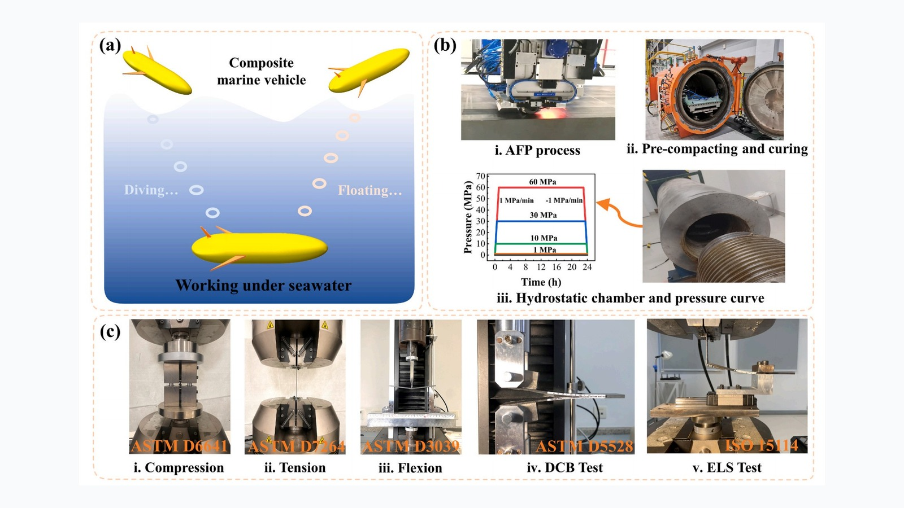
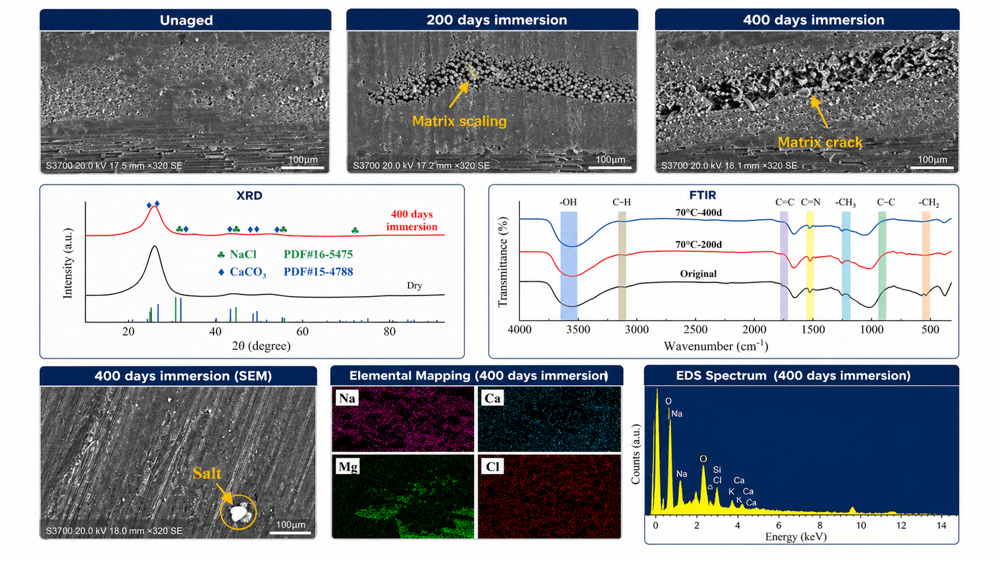
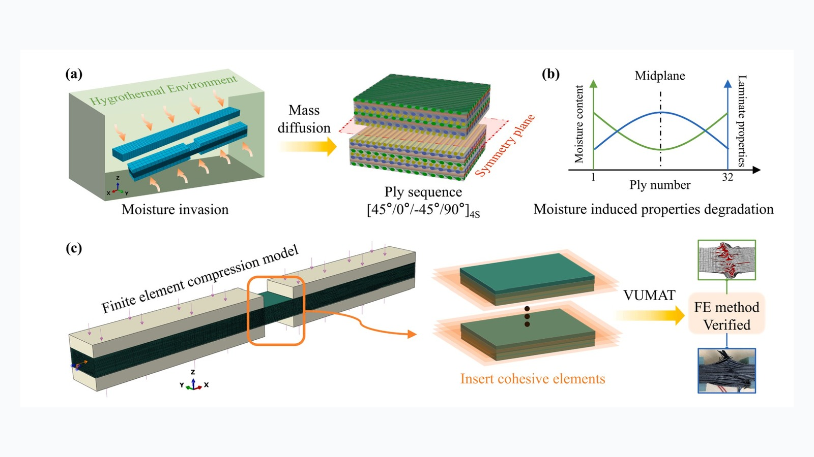

```{=html}
<div class="home-hero">
  <div class="hero-portrait-wrap">
    
  </div>
  <div class="hero-copy">
    <h1 class="hero-name">Yuchi Liu</h1>
    <div class="hero-role">Postdoctoral Researcher</div>
    <div class="hero-org">Tsinghua University</div>
    <p class="hero-bio">I work on the environmental durability and mechanical behavior of carbon fiber reinforced polymer (CFRP) composites, with particular interests in hygrothermal aging, interfacial damage, and multiscale finite element modeling.</p>
    <p class="hero-email"><strong>Email:</strong> <a href="mailto:liuyuchi@zju.edu.cn">liuyuchi@zju.edu.cn</a></p>
    <p class="hero-links"><a class="hero-button" href="https://scholar.google.com/citations?hl=zh-CN&user=frOLfcIAAAAJ" target="_blank" rel="noopener noreferrer">Google Scholar</a></p>
  </div>
</div>
```

## Research Highlights

```{=html}
<div class="highlight-carousel" data-carousel>
  <button class="carousel-btn prev" type="button" aria-label="Previous research highlight">‹</button>
  <div class="carousel-viewport">
    <div class="carousel-track">
      <section class="carousel-slide is-active">
        
        <h3>Marine Durability under Seawater and Hydrostatic Pressure</h3>
      </section>
      <section class="carousel-slide">
        
        <h3>Hygrothermal Aging Mechanisms of CFRP Composites</h3>
      </section>
      <section class="carousel-slide">
        
        <h3>Coupled Moisture–Mechanical Prediction of Compression Failure</h3>
      </section>
    </div>
  </div>
  <button class="carousel-btn next" type="button" aria-label="Next research highlight">›</button>
  <div class="carousel-dots" aria-label="Research highlight carousel controls">
    <button class="dot is-active" type="button" aria-label="Go to highlight 1"></button>
    <button class="dot" type="button" aria-label="Go to highlight 2"></button>
    <button class="dot" type="button" aria-label="Go to highlight 3"></button>
  </div>
</div>
```
